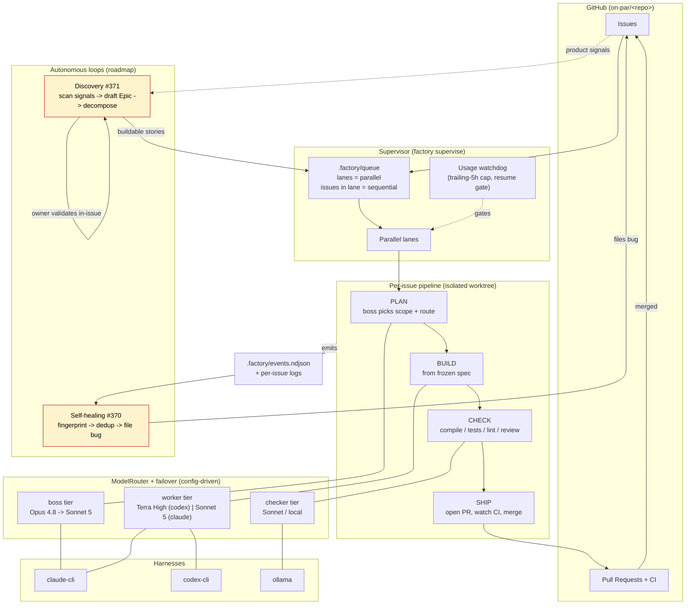
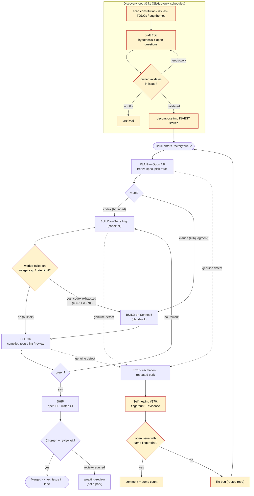

# ADR-0005: Autonomous factory loops — auto-failover, self-healing, and discovery

- Status: Proposed
- Date: 2026-07-20

## Context

The factory (ADR-0001) ships a queue it is given. Three gaps keep it from
running unattended for long stretches:

1. **Quota cliffs.** The coding worker is preferred (and often pinned) to a
   Codex-harness model such as GPT-5.6 Terra. When the ChatGPT/Codex account
   hits its usage cap or a rate limit, `ModelRouter.resolveAll()` applies a hard
   `requires: codex` filter to the build route, so the only failover targets are
   other Codex-harness models on the same exhausted quota. The lane parks. The
   only recovery today is a manual `FACTORY_CODEX=0` flip.
2. **Silent faults.** Genuine defects (unhandled exceptions, checker crashes,
   reproducible escalations, repeated identical parks) land in
   `.factory/events.ndjson` and are forgotten. Nothing turns them into tracked,
   fixable work.
3. **Empty queue.** When the backlog drains, the factory idles. Nothing
   generates grounded new work.

## Decision

Add three capabilities, each scoped as an epic of INVEST stories in
`on-par/software-factory`:

- **Auto-failover Terra to Sonnet on quota exhaustion — epic #366** (#367 cross-harness
  build failover, #368 precise usage-cap/rate-limit classification, #369
  supervisor circuit breaker + cooldown + config + observability). On a genuine
  quota/rate-limit signal with no Codex worker left, a codex-routed build
  continues on the Claude fallback (Sonnet 5); a breaker keeps other lanes off
  the dead provider for a cooldown window.
- **Self-healing loop — epic #370** (#372 failure fingerprint + evidence capture,
  #373 auto-file a bug with dedup + repo routing, #374 filing policy, rate caps,
  and a human gate for factory-self-fixes). Real defects are fingerprinted,
  deduplicated against open issues, and filed as `bug` for the factory to fix.
- **Discovery loop — epic #371** (#375 discovery scan of product signals, #376
  draft-Epic authoring + lifecycle labels + in-issue owner questions, #377
  in-issue dialogue to validation, then decompose into buildable stories).
  Communication is GitHub-only: the owner steers each idea from inside the Epic
  issue. Nothing becomes buildable work until the owner marks it validated.

Model posture in force (2026-07-20): boss/planner Opus 4.8, coding worker
GPT-5.6 Terra High, Sonnet 5 as the Claude-route worker and the failover target.

### Architecture

### End-to-end flow

## Consequences

- The factory can absorb a mid-run quota cliff without parking every codex lane,
  can convert its own recurring faults into tracked bugs, and can refill its
  backlog from grounded signals with the owner as the gate.
- New failure mode to guard: the self-healing loop touches the tracker and the
  discovery loop touches the backlog, so both need caps and dedup, and any
  fix that modifies factory core, the merge path, or security is human-gated
  (see #374). This ADR is Proposed until #366/#370/#371 land.
- Self-healing depends on #368/#272 for clean signals, so it sequences after the
  failover classification work. Discovery is independent.
