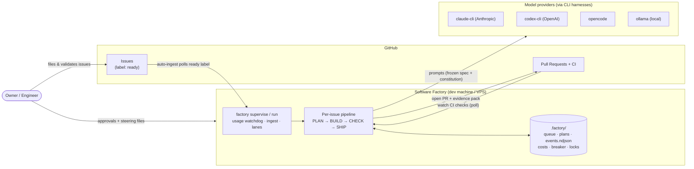
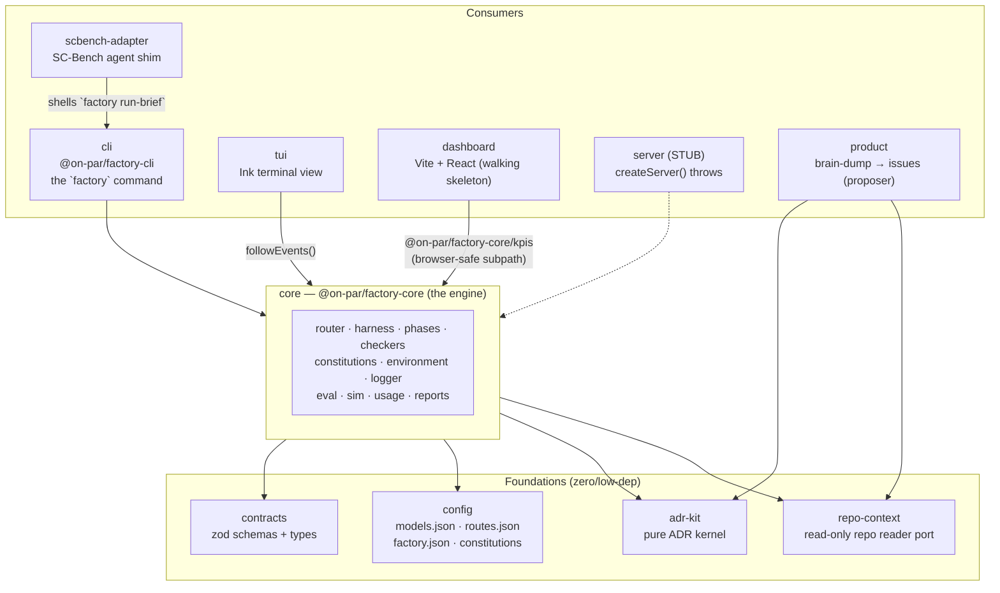
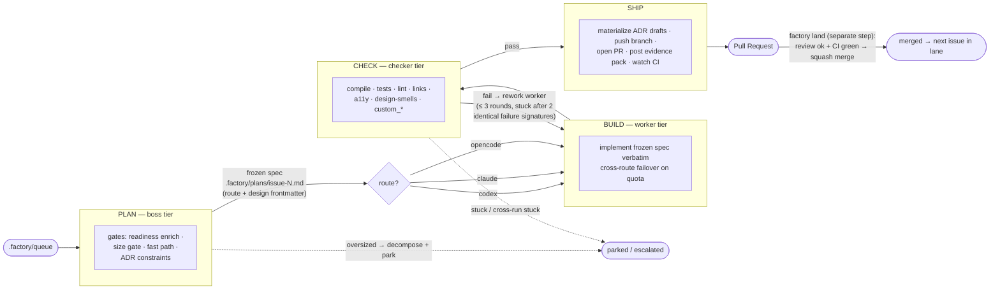
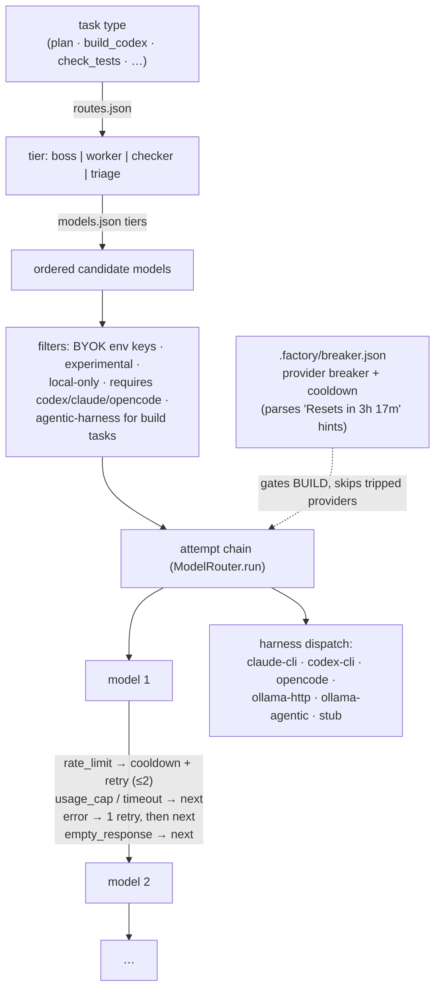
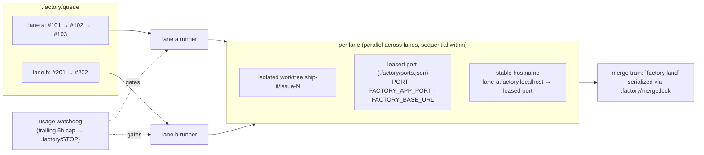
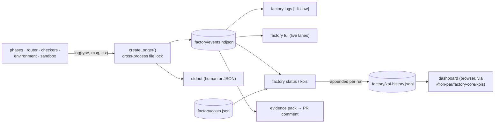

# Software Factory — Architecture

This document describes the architecture of **Software Factory** for architects, tech
leads, and product owners: what the system is, the components it is built from, how an
issue flows through it, and the key mechanisms that make it safe to run autonomously.

Sources of truth: [AGENTS.md](../AGENTS.md) for conventions,
[`docs/adr/`](./adr/README.md) for decisions. This document is a rendered overview and
should be updated when those change.

## 1. What it is

Software Factory is a TypeScript/Node.js monorepo that ships verified GitHub issues
autonomously through a **boss–worker–checker** pipeline (**PLAN → BUILD → CHECK →
SHIP**, [ADR-0001](./adr/0001-boss-worker-checker-pipeline.md)). Its distinguishing
ideas:

- **Config-driven multi-provider model routing** with automatic failover — free/local
  models first where they suffice, cloud models ranked per task tier
  (`packages/config/src/models.json` + `routes.json`).
- **Per-product constitutions** — a written "standard + how to verify it" injected into
  every phase prompt, resolved repo-first so a worker cannot author the standards it is
  graded by.
- **Independent verification** — a checker framework with a bounded rework loop. A
  worker's self-report is never trusted; checkers verify the output.

The engine (`@on-par/factory-core`) is UI-less and packaged so the CLI (and, in phase 2,
a server) can consume it.

## 2. System context

Humans stay in the loop through GitHub (issue validation, PR review) and through
file-based seams on disk: an approval gate (`.factory/approvals/`) for plan/ship
sign-off and steering messages (`.factory/steering/`) drained before BUILD and before
each rework round. Merging is off by default (`FACTORY_MERGE=1` opts in).

## 3. Monorepo components

npm workspaces + TypeScript composite project references. Dependency direction is
strictly one way: foundations ← core ← consumers.

| Package           | npm name                    | Role                                                                                     | Status            |
| ----------------- | --------------------------- | ---------------------------------------------------------------------------------------- | ----------------- |
| `contracts`       | `@on-par/contracts`         | Shared typed seam: zod schemas for Issue/Epic/Story/DesignArtifact                       | published         |
| `config`          | `@on-par/factory-config`    | Source of truth for routing, factory settings, constitutions; zero-dependency            | published         |
| `adr-kit`         | `@on-par/adr-kit`           | Pure ADR parse/serialize/numbering, no I/O                                               | published         |
| `repo-context`    | `@on-par/repo-context`      | Read-only repo reader port (fs, GitHub contents API, in-memory)                          | published         |
| `core`            | `@on-par/factory-core`      | The engine; narrow public root export ([ADR-0004](./adr/0004-narrow-public-core-api.md)) | published         |
| `cli`             | `@on-par/factory-cli`       | The `factory` CLI: ship, run, land, supervise, triage, doctor, kpis…                     | published         |
| `tui`             | —                           | Live Ink terminal dashboard over the event log                                           | private           |
| `dashboard`       | `@on-par/factory-dashboard` | KPI trends from `.factory/kpi-history.jsonl`                                             | private, skeleton |
| `product`         | `@on-par/product`           | Proposer app: interview → intent → architecture/ADRs → decompose → judge → export issues | private           |
| `scbench-adapter` | —                           | Runs the factory as an SC-Bench benchmark agent                                          | private           |
| `server`          | `@on-par/factory-server`    | Phase-2 SaaS stub; intentionally throws                                                  | private, stub     |

## 4. The pipeline

The orchestrator is `shipIssue()` in `packages/cli/src/cli/index.ts`; the four phases
are plain async functions in `packages/core/src/phases/`. Every issue runs in an
isolated git worktree (`ship-it/issue-N`, created as a sibling of the repo).

**PLAN (boss).** A strong model reads the issue and the repo and freezes a spec with
YAML frontmatter. Before the model runs: the work source is resolved (GitHub issue or
local brief), readiness is scored (a failing `factory-task` body is rewritten via the
GitHub API), the **size gate** decomposes oversized issues into INVEST stories
([ADR-0010](./adr/0010-the-readiness-size-gate-re-implements-the-invest-small-rule-inside-core.md)),
a **fast path** can bypass the model entirely for trivially mechanical work, and
Accepted ADRs are rendered as constraints. After the model runs, a **build-scope gate**
bounds the design artifact (≤ 6 target types, ≤ 8 signatures, ≤ 10 call-graph edges) or
decomposes and parks. Crucially the boss makes the per-issue **build-route decision**
(`route: codex | claude | opencode`) — judgment is paid once per issue.

**BUILD (worker).** A cheaper model implements the frozen spec verbatim; the spec is
frozen precisely so a weak worker cannot drift scope. On `usage_cap` / `rate_limit` /
`timeout` the build fails over across routes (codex ⇄ claude) and trips the
provider breaker so other lanes avoid the exhausted provider.

**CHECK (checker).** Independent checkers verify the worktree — never the worker's
self-report. Failures drive a bounded rework loop: at most 3 rounds; 2 consecutive
identical failure signatures mark the lane **stuck**; a signature matching the previous
run's (`.factory/rework-history.json`) skips rework entirely and holds the lane
([ADR-0017](./adr/0017-a-rework-round-where-no-model-ran-is-neutral-for-stuck-accounting-and-classified-by-the-router-s-own-failure-reason.md)).
The worktree is probed once per round and checkers consume those shared facts
([ADR-0022](./adr/0022-check-probes-the-worktree-once-per-round-and-checkers-consume-those-facts.md)).

**SHIP.** Materializes any ADR drafts from the plan, pushes the branch, opens the PR
(`Closes #N`), posts an evidence pack comment (what was checked and how), and watches
CI. CI conclusions are allow-listed (`success | neutral | skipped`) and the gate fails
closed on anything else
([ADR-0014](./adr/0014-ci-merge-gate-fails-closed-on-non-allow-listed-check-conclusions.md));
a check-run set is final only after a settle window
([ADR-0015](./adr/0015-a-check-run-set-is-final-only-after-a-settle-window.md)).
**SHIP never merges** — `factory land` squash-merges an approved, CI-green PR as a
separate, serialized step.

## 5. Model routing and failover

Routing is config-driven end to end; core never hard-codes model lists.

| Tier      | Used for                                                  | Example models                             |
| --------- | --------------------------------------------------------- | ------------------------------------------ |
| `boss`    | PLAN, dispute resolution                                  | Claude Fable 5 / Opus 5 (claude-cli)       |
| `worker`  | BUILD (`build_codex` / `build_claude` / `build_opencode`) | GPT-5.6 (codex-cli), Sonnet 5 (claude-cli) |
| `checker` | CHECK tasks, PR/security review, eval judge               | Sonnet 5, local Ollama models              |
| `triage`  | readiness enrichment, decomposition                       | cheaper cloud/local models                 |

Failure classification happens in one place (`harness/classify.ts`). For agentic tasks
the router snapshots and rolls back worktree state between failover attempts so two
models' work never mixes. Every successful call emits a cost row to
`.factory/costs.jsonl`.

## 6. Verification: checkers and constitutions

`runAllCheckers()` runs the checker list **sequentially and fail-closed**: a crashed
checker is a FAIL, an unknown constitution-declared checker is a FAIL.

| Checker         | What it does                                                                                        |
| --------------- | --------------------------------------------------------------------------------------------------- |
| `compile`       | `npm run build` → `make` → `cargo build` (first that exists)                                        |
| `tests`         | `scripts/verify.sh --no-e2e` → `npm test`; FAIL when the constitution requires tests and none exist |
| `lint`          | `npm run lint` + `npx tsc --noEmit`                                                                 |
| `links`         | scans HTML for placeholder/broken `href`/`src`                                                      |
| `accessibility` | images without `alt`, placeholder links                                                             |
| `design_smells` | agent-backed review of the real diff vs `origin/main` (cast-to-pass, swallowed errors, …)           |
| `custom_*`      | constitution-declared LLM checkers; malformed verdict JSON = FAIL                                   |

**Constitutions** are markdown files with YAML frontmatter (`product`, `checkers`,
`requireTests`) in `packages/config/src/constitutions/`. At run start the loader
resolves **repo-first**: the target repo's own `CLAUDE.md` / `AGENTS.md` /
copilot-instructions supply the body; a configured product constitution contributes its
checker list and `requireTests`, and its body is appended. The rendered
`<constitution>` block is injected into PLAN, BUILD, and rework prompts.

## 7. Concurrency, state, and isolation

- **Lanes are parallel; issues within a lane are strictly sequential.** A park aborts
  the rest of that lane.
- Every agent and checker command runs with a leased port and headless env injected
  (`FACTORY_HEADLESS=1`, `PLAYWRIGHT_HEADLESS=1`), inside a sandbox policy, in a
  tracked process group that is SIGTERM/SIGKILL-reaped when the lane ends.
- All cross-process state lives under `.factory/`: queue, plans, events, costs, KPI
  history, breaker, rework history, approvals, steering, locks, port leases, STOP.
  File locks use fenced stealing of stale holders
  ([ADR-0009](./adr/0009-fenced-steal-of-stale-file-locks.md)).

## 8. Observability

Structured logging over an append-only event log
([ADR-0002](./adr/0002-structured-logging-via-event-log.md)) — deliberately a file, not
a logging service, so every consumer (CLI, TUI, KPIs, evidence packs) reads the same
record.

## 9. Quality engineering

- **Eval harness** (`scripts/eval.ts`, `core/src/eval/`): golden cases in
  `evals/golden/*.md` are run through the **real PLAN prompt and router**; a
  deterministic stub subset gates every CI PR, the full LLM-judge mode runs
  locally/nightly, with baseline comparison and trend history.
- **Simulator** (`core/src/sim/`): drives the real four phase functions against owned
  fakes (scripted model executor, fake octokit, throwaway git workspace) with seeded
  jitter/failure injection; `npm run sim-monte-carlo` aggregates shipped/parked rates
  against thresholds. Regression fixtures pin known production faults.
- **Verification gate** (`scripts/verify.sh`, mirrored by CI): format → build →
  typecheck → lint → knip → tests with ratcheting coverage thresholds (never lowered)
  → stub eval.

## 10. Key decisions (ADR highlights)

| ADR                                                                                                                  | Decision                                                           |
| -------------------------------------------------------------------------------------------------------------------- | ------------------------------------------------------------------ |
| [0001](./adr/0001-boss-worker-checker-pipeline.md)                                                                   | Boss–worker–checker pipeline with per-issue build routing          |
| [0002](./adr/0002-structured-logging-via-event-log.md)                                                               | Structured logging via an append-only NDJSON event log             |
| [0004](./adr/0004-narrow-public-core-api.md)                                                                         | `core`'s root export is a narrow public API                        |
| [0005](./adr/0005-autonomous-factory-loops.md)                                                                       | Autonomous loops: auto-failover, self-healing, discovery (roadmap) |
| [0009](./adr/0009-fenced-steal-of-stale-file-locks.md)                                                               | Fenced steal of stale file locks                                   |
| [0014](./adr/0014-ci-merge-gate-fails-closed-on-non-allow-listed-check-conclusions.md)                               | CI merge gate fails closed on non-allow-listed conclusions         |
| [0015](./adr/0015-a-check-run-set-is-final-only-after-a-settle-window.md)                                            | A check-run set is final only after a settle window                |
| [0022](./adr/0022-check-probes-the-worktree-once-per-round-and-checkers-consume-those-facts.md)                      | CHECK probes the worktree once per round                           |
| [0023](./adr/0023-hosted-execution-on-vps-docker-with-stock-docker-sandboxing-and-github-app-installation-tokens.md) | Hosted execution: VPS + Docker + GitHub App tokens                 |
